# BankLedger-Backend

A RESTful backend API for a digital banking system, built with **Node.js**, **Express.js**, and **MongoDB (Mongoose)**. It supports user authentication, account management, and secure fund transfers using a double-entry ledger system.

## Tech Stack

- **Runtime:** Node.js
- **Framework:** Express.js
- **Database:** MongoDB with Mongoose ODM
- **Dev Tooling:** Nodemon (hot reload during development)
- **Email:** Nodemailer / email service integration for transaction notifications
- **Environment Management:** dotenv (`.env` config)

## Features

### Authentication
- User registration and login
- Session/token-based authentication via middleware
- Logout support
- Separate middleware for **system-level users** (used for privileged operations like initial fund disbursement)

### Account Management
- Create a new bank account linked to a registered user
- Fetch all accounts belonging to the logged-in user
- Check real-time account balance, calculated dynamically from ledger entries (not a stored/static field)
- Account status handling (`ACTIVE`, `FROZED`, `CLOSED`)

### Transactions & Fund Transfers
- Peer-to-peer fund transfers between two user accounts
- System-initiated **initial funds** disbursement to newly registered users (restricted to system users via dedicated middleware)
- **Idempotency key support** — prevents duplicate transaction processing on repeated/retried requests
- **Insufficient balance validation** before processing any transfer
- **Account status validation** — both sender and receiver accounts must be `ACTIVE`
- **MongoDB transactions (sessions)** to ensure atomicity — a transfer either fully completes (transaction + both ledger entries) or fully rolls back on failure
- Transaction status lifecycle: `PENDING` → `COMPLETED` / `FAILED` / `REVERSED`

### Ledger System
- Double-entry ledger design — every transaction creates a `DEBIT` entry (sender) and a `CREDIT` entry (receiver)
- Account balances are derived on-demand via MongoDB aggregation over ledger entries, ensuring an auditable, tamper-resistant transaction history

### Notifications
- Automated email notifications sent to users on successful transactions

## Project Structure

```
BankLedger-Backend/
├── src/
│   ├── controller/       # Route handlers (business logic)
│   │   ├── user.controller.js
│   │   ├── account.controller.js
│   │   └── transaction.controller.js
│   ├── model/            # Mongoose schemas (User, Account, Transaction, Ledger)
│   ├── middleware/        # Auth middleware (user & system-user)
│   ├── service/           # External services (e.g. email)
│   └── routes/            # Express route definitions
├── images/                  # API demo screenshots (referenced in this README)
├── server.js               # App entry point
├── .env                     # Environment variables (not committed)
└── package.json
```

## Getting Started

```bash
# Install dependencies
npm install

# Set up environment variables
cp .env.example .env   # then fill in your MongoDB URI, email credentials, etc.

# Run in development mode (auto-restarts on file changes)
npm run dev
```

Once running, you should see confirmation in the terminal that the server has started and connected to MongoDB:

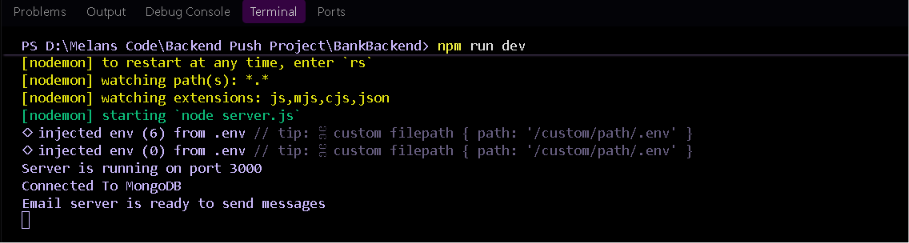

## API Documentation

### Auth — `/api/user`

| Method | Endpoint          | Description               | Protected |
|--------|--------------------|----------------------------|-----------|
| POST   | `/api/user/register` | Register a new user       | No        |
| POST   | `/api/user/login`    | Log in a user              | No        |
| POST   | `/api/user/logout`   | Log out the current user   | No        |

**Register a new user**

`POST /api/user/register`

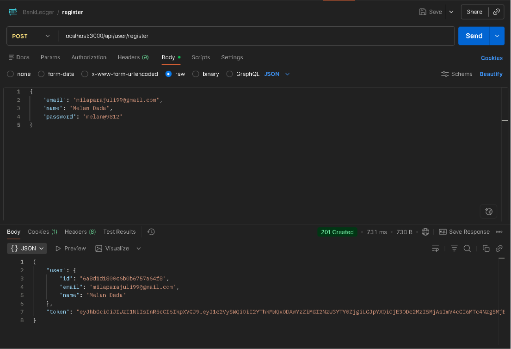

**Log in a user**

`POST /api/user/login`

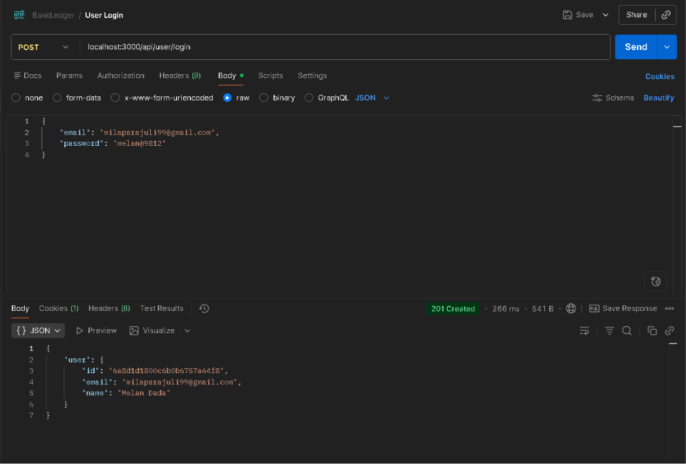

---

**User Logout**

`POST /api/user/logout`

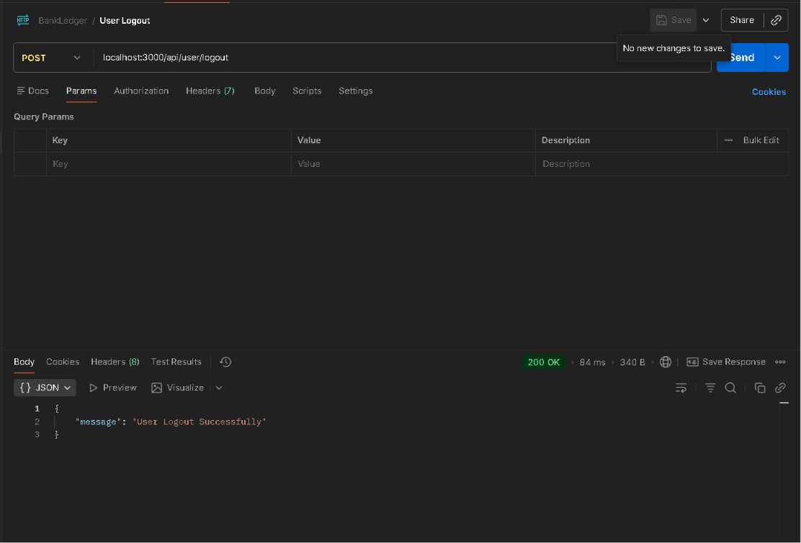

---


### Accounts — `/api/accounts`

| Method | Endpoint                          | Description                          | Protected |
|--------|-------------------------------------|---------------------------------------|-----------|
| POST   | `/api/accounts/`                   | Create a new account                  | Yes       |
| GET    | `/api/accounts/`                   | Get all accounts for the logged-in user | Yes    |
| GET    | `/api/accounts/balance/:accountId` | Get current balance of an account     | Yes       |

**Create a new account**

`POST /api/accounts/`

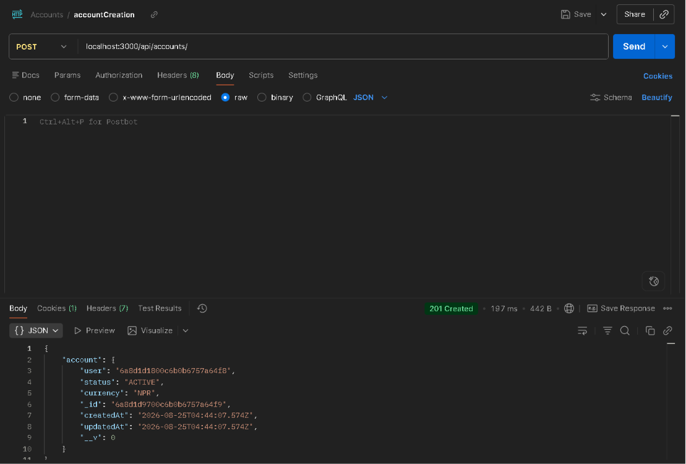

**Fetch account details for logged-in user**

`GET /api/accounts/`

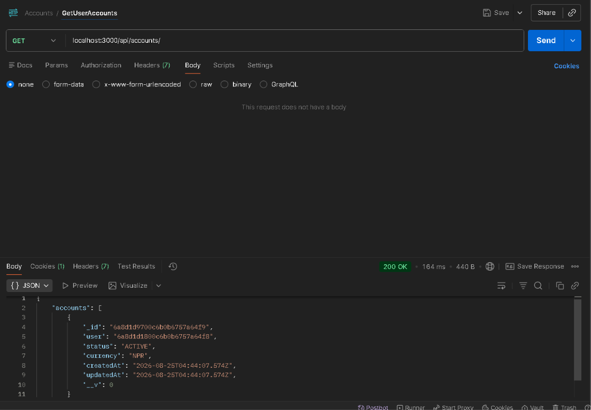

**Check account balance**

`GET /api/accounts/balance/:accountId`

Balance is calculated dynamically from the ledger — below are examples showing an account's balance both before (as sender) and after (as recipient) a transaction:

From-account balance:
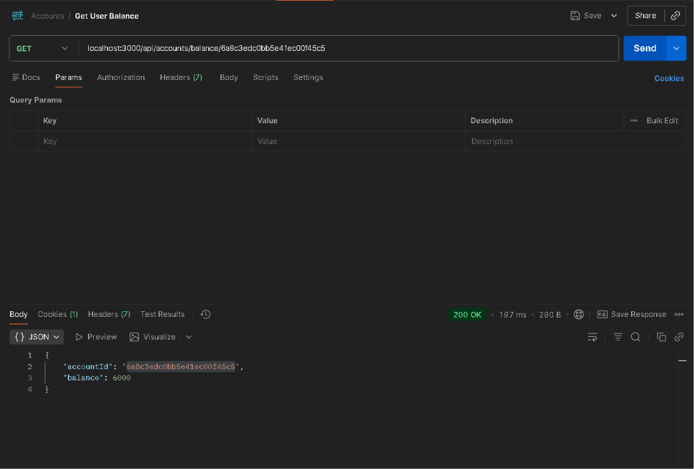

To-account balance:
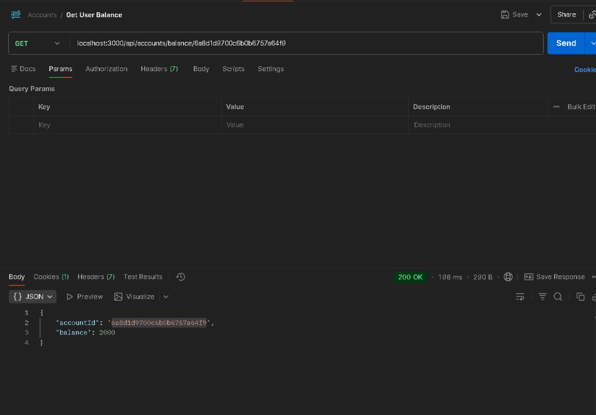

Current balance check:
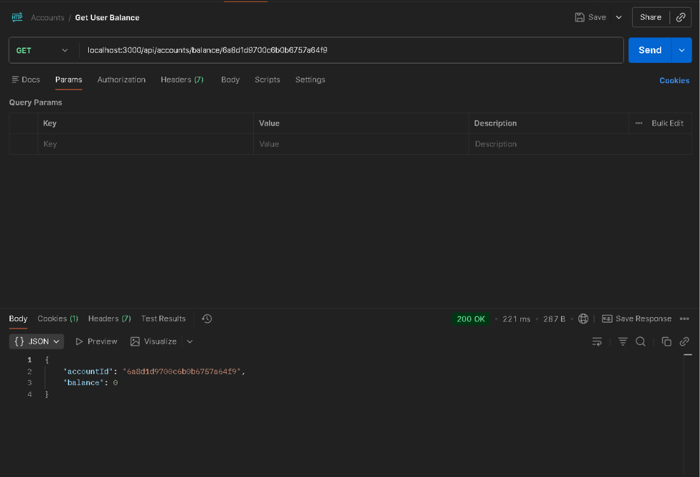

---

### Transactions — `/api/transaction`

| Method | Endpoint                            | Description                                       | Protected               |
|--------|---------------------------------------|-----------------------------------------------------|--------------------------|
| POST   | `/api/transaction/`                  | Transfer funds between two user accounts            | Yes (user)               |
| POST   | `/api/transaction/system/initial-funds` | Credit initial funds to a new account from the system account | Yes (system user only) |

**Transfer funds between two users**

`POST /api/transaction/`

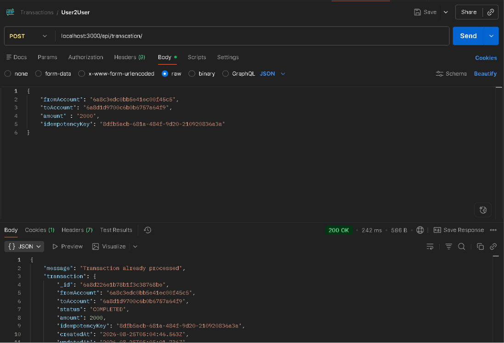

**Email notification on successful transaction**

After a successful transfer, the sender receives an automated email confirmation:

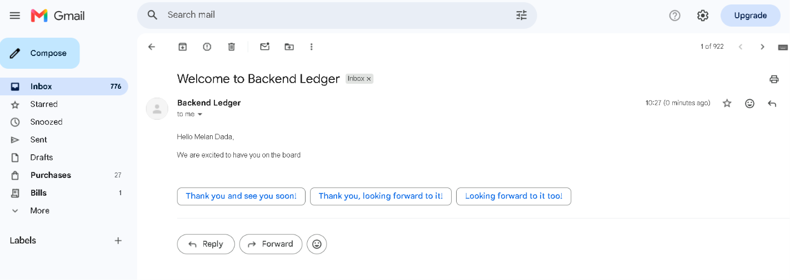

> All protected routes require a valid auth token/session, passed via the corresponding middleware.

## Roadmap / Possible Next Steps
- Transaction history endpoint per account
- Reversal/refund flow for `FAILED` transactions
- Rate limiting on transfer and auth endpoints
- Automated tests (unit + integration)
